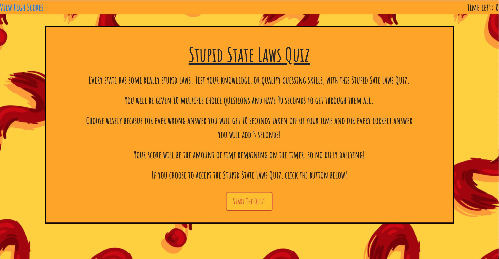
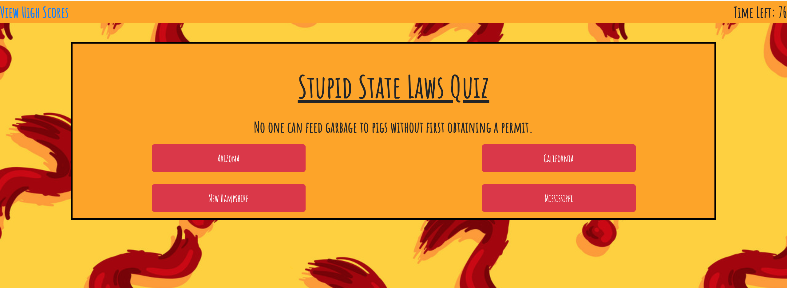
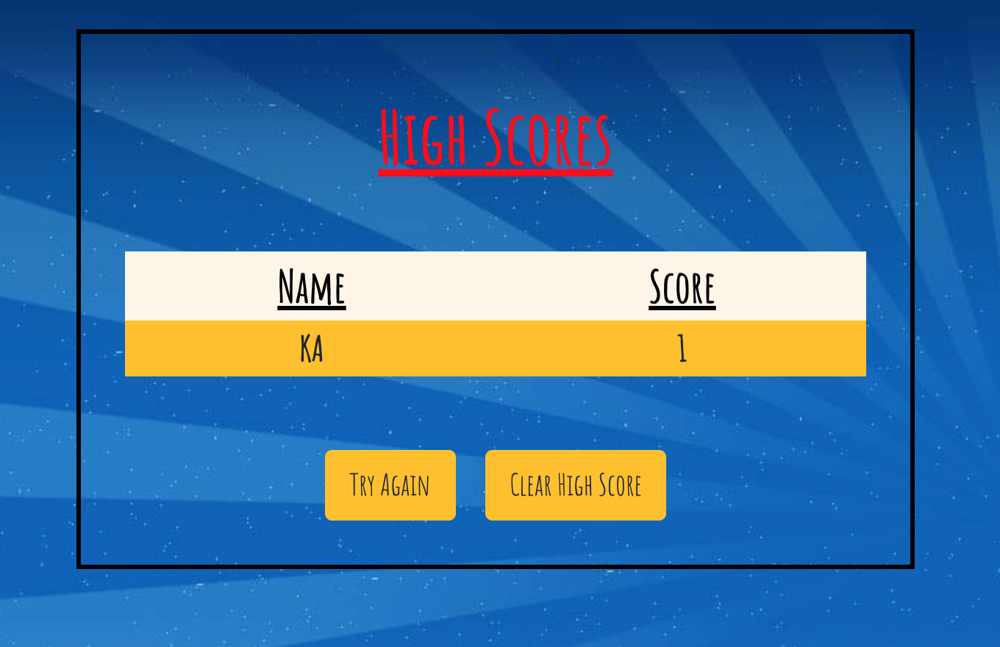

# Stupid States Law Quiz

This project is a quiz about the stupid random state laws in the US.  The user starts the quiz by clicking the "Start The Quiz" button.  They then have multiple choice questions about the stupid laws in different states and have 75 seconds to complete the 10 question quiz.  If the user gets a question correct they will simply move to the next question.  If the user gets a question wrong, 10 seconds will subtract from the time left and they will move onto the next question.  Correct and Wrong will show up on the bottom of the container to notify the user.

After the game is complete, the user's score will be the amount of seconds left.  This will be displayed.  The user may then input their initials into the input field and press the "submit" button.  After clicking the submit button, the user will be directed to the high scores page.  

The high scores page will display the scores of the game.  From this page, the user may clear the high scores, or choose to try the quiz again by using the buttons provided.
 

This project was creaded using HTML, CSS, JavaScript, jQuery, and Bootstrap.

## Visual of Application

### Start of the Quiz

### Question

### After Quiz is Complete

### High Scores

The following link will bring you to the Random Password Generator: 
* https://karenastell.github.io/codequiz/
* https://github.com/karenastell/codequiz

